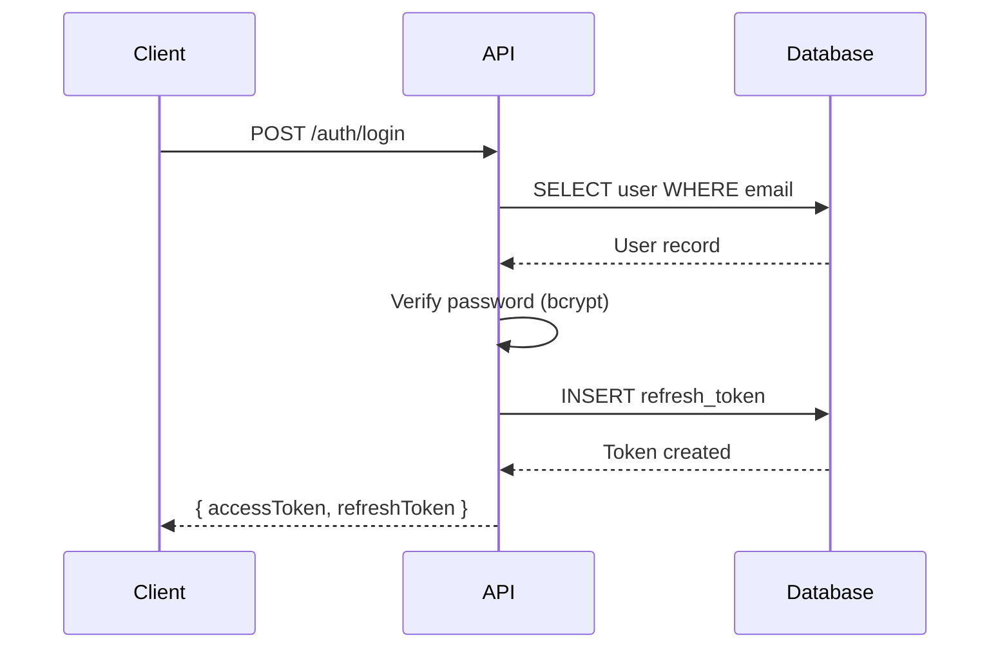

# Agent 0: Agent Constitution v4.6 (Application-Agnostic)

## FRAMEWORK VERSION

Framework: Agent Specification Framework v2.1
Constitution: Agent 0 - Agent Constitution v4.6
Status: Active
Optimization: Claude Sonnet

---

## FRAMEWORK VERSIONING SEMANTICS

**All framework components follow semantic versioning:**

| Version Type | Increment When | Impact | Example |
|--------------|----------------|--------|---------|
| MAJOR | Breaking agent behavior, fundamental rule changes, authority boundary shifts | Requires review of all downstream agents, may invalidate existing outputs | v2.1 -> v3.0 |
| MINOR | Additive rules, new guardrails, enhanced detection patterns, new optional features | Backwards compatible, existing outputs remain valid | v4.0 -> v4.1 |
| PATCH | Clarifications, examples, formatting, documentation improvements, typo fixes | No functional change, pure clarity enhancement | v4.1.0 -> v4.1.1 |

**Upgrade Decision Tree:**
```
Does change affect agent outputs or decisions?
|-- YES -> Is old output still valid?
|   |-- NO -> MAJOR (breaking change)
|   `-- YES -> Does it add new requirements?
|       |-- YES -> MINOR (additive)
|       `-- NO -> PATCH (clarification)
`-- NO -> PATCH (documentation only)
```

**Version Communication Rule:**
Every agent MUST include a "What Changed Since vX.Y" section when incrementing version, listing:
- New mandatory rules
- Deprecated patterns
- Behavior changes
- Impact on Claude Code execution

This prevents Claude Code from operating on outdated mental models.

---

## VERSION HISTORY

| Version | Date | Changes | What Changed Since Previous Version |
|---------|------|---------|-------------------------------------|
| 4.6 | 2026-02 | **MINOR:** Added Tiered Prevention Model (Section W) and Specification Freeze Hash (Section X). Establishes 3-tier verification architecture (Pre-Flight/Progressive/Post-Build) with 82 patterns distributed across build phases. Specification freeze hash prevents mid-build spec modifications. Based on production audit showing 20 issues despite 82 detection patterns - root cause was patterns running post-build instead of during build. Prevention-first paradigm shift; Hygiene Gate: PASS | **Additive:** All agents now operate under tiered prevention model with verification gates at optimal checkpoints. Tier 1 (Pre-Flight): 20 patterns run before code generation starts, blocking security/config issues. Tier 2 (Progressive): 40 patterns run after each build phase, blocking incomplete implementations. Tier 3 (Post-Build): 22 patterns validate integration, auto-fix edge cases. Specification freeze hash generated before Phase 0, verified after each phase to detect mid-build modifications. Claude Code now enforces 60 blocking gates during build (vs 0 previously). Expected outcome: 99.9% prevention rate (vs 76% detection rate). No breaking changes to existing agents - adds enforcement mechanisms only. |
| 4.5 | 2026-01 | **MINOR:** Added Agent Output Protocol (Section U) and Constitution Reference Rule (Section V). Mandates single-file output per agent (addresses audit finding where Agent 6 created 6 separate files instead of 1). Establishes inheritance model for constitution references (agents inherit from Agent 0 generically, not version-specific). Based on production deployment findings and maintenance burden analysis; Hygiene Gate: PASS | **Additive:** All agents MUST produce exactly ONE output file containing all required content, templates, and scripts inline. Verification scripts, readme files, and supplementary documents MUST be embedded in the single output document, not created as separate files. Constitution references standardized to "Inherited from Agent 0" (eliminates cascading version updates when constitution changes). Output files should remain under 5000 lines for LLM processing efficiency. Self-contained documents enable complete specification delivery in single artifact. |
| 4.4 | 2026-01 | **MINOR:** Framework alignment update. Constitution references updated across agent framework (Agents 2-8) to v4.4 for consistency. Technical pattern enforcement enhanced; Hygiene Gate: PASS | **Additive:** Constitution version alignment across all framework agents. No functional changes to rules or requirements. |
| 4.3 | 2026-01 | **MINOR:** Added Network Binding Addresses requirement to Section C with comprehensive IPv4/IPv6 compatibility rules. Prevents ECONNREFUSED errors in Replit development environment. Based on production deployment audit findings; Hygiene Gate: PASS | **Additive:** All server binding addresses MUST follow explicit IPv4/IPv6 rules. Frontend (Vite) binds to 0.0.0.0:5000 for external access. Backend (Express) binds to 127.0.0.1:3001 in development (IPv4 explicit for proxy compatibility) and 0.0.0.0:5000 in production. Forbidden pattern: binding to "localhost" (causes IPv6/IPv4 mismatch). Agent responsibilities defined (Agent 2: ADR, Agent 6: enforcement, Agent 8: detection). Verification command provided. Prevents connection refused errors between Vite proxy and Express backend. |
| 4.2 | 2026-01 | **MINOR:** Added Cryptographic Randomness requirement to Section C with comprehensive implementation guidance. Prevents use of Math.random() for security-sensitive values (unique IDs, filenames, tokens, session IDs, CSRF tokens). Enhanced Section E cross-reference; Hygiene Gate: PASS | **Additive:** All random value generation for security purposes MUST use crypto.randomBytes(). Explicit forbidden patterns (Math.random()) and required patterns documented with security rationale. Table of use cases with byte sizes. Agent responsibilities defined (Agent 2: ADR, Agent 6: enforcement, Agent 8: detection). Verification command provided. Prevents session hijacking, token forgery, file enumeration, and CSRF bypass attacks. |
| 4.1 | 2026-01 | **MINOR:** Added Implementation Completeness Standards (P), Code Template Requirements (Q), Middleware Integration Mandates (Q1), External API Templates (Q2), File Parsing Requirements (Q3), Streaming Export Patterns (Q4), Integration Flow Requirements (R), Dependency Injection Standards (R1), Verification Protocol (S). Based on Claude Code feedback on specification gaps causing incomplete implementations; Hygiene Gate: PASS | **Additive:** All specifications must now include executable code (no pseudocode), implementation completeness markers (STUB/PARTIAL/COMPLETE), explicit middleware configurations, complete external API client code, file parsing with actual libraries, streaming export implementations, integration flow diagrams, dependency injection patterns, and curl-based verification commands. |
| 4.0 | 2026-01 | **MAJOR:** Added Rule Priority Tiers (A1), Assumption Register Lifecycle Contract (B1), Framework Versioning Semantics (above), Rule Classification Guidance (C1), "What Changed" mandate for all agents. Enhanced cognitive load management for LLM execution under token pressure; Hygiene Gate: PASS | **Breaking:** All agents must now classify rules as CRITICAL/HIGH/GUIDANCE. Assumption Registers must include lifecycle metadata. Version history must include "What Changed" explanations. |
| 3.3 | 2026-01 | Application-agnostic update: Removed all project-specific references to maintain framework universality; Hygiene Gate: PASS | Removed project names, made framework universally applicable |

---

## PURPOSE

This Constitution defines **non-negotiable global rules** for the entire agent chain. 

**Key Principles:**
1. All agents inherit these rules automatically
2. Agents must NOT duplicate these rules except via the "Inherited Constitution" statement
3. This document is the single source of truth for cross-cutting concerns
4. When in doubt, refer back to this Constitution

**v4.6 Update:** Added tiered prevention model (Section W) establishing 3-tier verification architecture with 82 patterns distributed across build lifecycle. Specification freeze hash (Section X) prevents mid-build spec modifications. Paradigm shift from post-build detection to during-build prevention.

**v4.5 Update:** Added Agent Output Protocol mandating single-file outputs with all scripts/templates embedded inline.

**v4.3 Update:** Added network binding addresses requirement preventing use of "localhost" for server binding.

**v4.2 Update:** Added cryptographic randomness requirement preventing use of Math.random() for security-sensitive values.

**v4.1 Update:** Added comprehensive implementation completeness standards. Key principle: **"If it's not shown as working code, it won't be implemented."**

---

## A) CROSS-AGENT AUTHORITY ORDER

### When Conflicts Arise

Use this precedence table to resolve conflicts between agents:

| Priority | Agent | Authority Domain | Example Conflicts They Resolve |
|----------|-------|------------------|--------------------------------|
| 1 | Agent 4 (API Contract) | All API conventions, endpoint shapes, response envelopes, error formats, pagination rules | "Should error be 400 or 422?" -> Agent 4 decides |
| 2 | Agent 2 (System Architecture) | Infrastructure decisions, deployment patterns, database configuration, platform requirements | "Which database driver?" -> Agent 2 decides |
| 3 | Agent 3 (Data Modeling) | Schema definitions, entity relationships, constraints, query patterns, ORM conventions | "Should we use soft delete?" -> Agent 3 decides |
| 4 | Agent 5 (UI/UX Specification) | Screens, user flows, UI patterns, role visibility, interaction states, component systems | "What screens exist?" -> Agent 5 decides |
| 5 | Agent 6 (Implementation Orchestrator) | Scaffolding, task ordering, file paths, implementation workflow, code templates | "What order to build features?" -> Agent 6 decides |
| 6 | Agent 7 (QA & Deployment) | Test requirements, deployment verification procedures, environment checklists | "How to verify deployment?" -> Agent 7 decides |
| 7 | Agent 8 (Code Review) | Audit findings only; must not introduce new spec requirements | "Does code match spec?" -> Agent 8 audits |

### Enforcement Rule

**When Agent X and Agent Y conflict:**
1. Find both agents in the priority table above
2. The agent with lower priority number wins
3. Document the conflict resolution in the winning agent's Assumption Register

---

## A1) RULE PRIORITY TIERS

**Purpose:** Enable Claude Code to reason intelligently under token pressure and cognitive constraints by explicitly signaling relative importance of rules.

### Priority Tier Definitions

All rules in this Constitution and downstream agents MUST be classified using one of these tiers:

| Tier | Keyword | Meaning | Violation Consequence | Usage Guideline |
|------|---------|---------|----------------------|-----------------|
| **P1** | **[CRITICAL]** | Absolute requirement. Violation blocks deployment. | DEPLOYMENT BLOCKER | Security, data integrity, platform compatibility, global invariants |
| **P2** | **[HIGH]** | Strong requirement. Violation triggers audit failure. | AUDIT FAILURE | Best practices, performance patterns, maintainability standards |
| **P3** | **[GUIDANCE]** | Recommended practice. Violation acceptable in MVP/time constraints. | ACCEPTABLE IN MVP | Optimization, polish, advanced patterns, future-proofing |

### Tier Application Rules

```
Does violation break production deployment?
  YES -> [CRITICAL]
  NO -> Does violation cause technical debt or risk?
    SIGNIFICANT -> [HIGH]
    MINOR -> [GUIDANCE]
```

### Prioritization Under Constraint

**If Claude Code must choose due to token limits or complexity:**

1. **ALWAYS implement [CRITICAL] rules** - these are non-negotiable security/platform requirements
2. **PREFER [HIGH] rules** when time allows - these prevent future technical debt
3. **DEFER [GUIDANCE] rules** to future iterations if under constraint

**Example Decision:**
```
Claude Code has 10 minutes left before timeout.
Remaining work: Add RBAC checks [CRITICAL] OR optimize N+1 queries [HIGH]
Decision: Complete RBAC first (security blocker), defer query optimization
```

---

## B) ASSUMPTION REGISTER CONTRACT

**Priority Tier:** CRITICAL  
**Enforcement:** All Agents

**RULE:** Every specification document MUST contain an Assumption Register tracking unresolved decisions and context propagated downstream.

**Purpose:**
- Explicitly document what was assumed vs. what was specified
- Enable downstream agents to validate assumptions or escalate conflicts
- Create audit trail for architectural decisions
- Prevent silent failures when assumptions prove incorrect

### Assumption Types

| Type | Definition | Example | Resolution Path |
|------|------------|---------|----------------|
| ASSUMPTION | Best-guess decision lacking definitive requirement | "Assuming users can belong to multiple orgs" | Validate with product owner |
| CONSTRAINT | External limitation affecting design | "Replit doesn't support WebSockets" | Accept or pivot architecture |
| DEPENDENCY | Reliance on external system/data | "Auth service provides user roles" | Verify integration contract |
| RISK | Known uncertainty with impact potential | "File upload size may exceed Replit limits" | Monitor and mitigate |
| CHANGE_REQUEST | Proposed modification to upstream spec | "Suggest pagination default of 50 not 20" | Agent authority escalation |

### Assumption Entry Format

**CRITICAL REQUIREMENT:** Each assumption MUST include:

```markdown
### AR-XXX: [Brief Title]

- **Type:** ASSUMPTION | CONSTRAINT | DEPENDENCY | RISK | CHANGE_REQUEST
- **Assumption:** [One-sentence statement of what was assumed]
- **Impact if Wrong:** [What breaks if assumption is invalid]
- **Resolution:** [How this gets validated/resolved]
- **Status:** UNRESOLVED | VALIDATED | REJECTED | ACCEPTED
- **Owner:** [Which agent or human validates this]
- **Downstream Impact:** [Which agents/phases affected]
- **Resolution Deadline:** [Phase/milestone when this must be resolved]
- **Allowed to Ship:** YES | NO
```

**Example:**
```markdown
### AR-001: Organization Membership Model

- **Type:** ASSUMPTION
- **Assumption:** Users can belong to only ONE organization at a time
- **Impact if Wrong:** Requires multi-tenant context switching in UI, changes auth model
- **Resolution:** Product owner confirms single-org model acceptable for MVP
- **Status:** UNRESOLVED
- **Owner:** Human (Product Owner)
- **Downstream Impact:** Agent 3 (data model), Agent 4 (API auth), Agent 5 (UI navigation)
- **Resolution Deadline:** Before Agent 3 execution
- **Allowed to Ship:** NO - blocks data model design
```

---

## B1) ASSUMPTION REGISTER LIFECYCLE CONTRACT (NEW IN v4.0)

**Priority Tier:** HIGH  
**Enforcement:** All Agents

**RULE:** Assumption Registers are living documents that cascade through agent chain with lifecycle metadata.

### Lifecycle States

| State | Meaning | Agent Action Required |
|-------|---------|----------------------|
| UNRESOLVED | Not yet validated | Downstream agents must check before proceeding |
| VALIDATED | Confirmed correct by owner | Safe to proceed, remove from register |
| REJECTED | Confirmed incorrect | BLOCKING - upstream agent must revise |
| ACCEPTED | Acknowledged limitation, proceeding anyway | Document trade-off, continue |

### Cascade Protocol

**When Agent N creates assumption:**
1. Add to Agent N's Assumption Register
2. Flag "Downstream Impact" agents
3. Downstream agents check register before starting
4. If BLOCKING assumption unresolved, downstream agent STOPS and escalates

**When assumption gets resolved:**
1. Update status in originating agent's register
2. Notify downstream agents
3. If REJECTED, downstream agents pause until upstream revision
4. Remove from register once VALIDATED (keep in changelog)

### Resolution Deadlines

**CRITICAL RULE:** Every assumption MUST have explicit deadline.

**Deadline Types:**
- `Before Agent X execution` - blocks next agent
- `Before Phase Y` - blocks implementation phase
- `Before deployment` - can ship to dev, not production
- `Post-MVP` - technical debt, document in backlog

**Enforcement:**
```
If current phase >= Resolution Deadline AND Status = UNRESOLVED:
  IF Allowed to Ship = NO:
    BLOCK execution, escalate to human
  ELSE:
    WARN, document in technical debt register, proceed
```

---

## C) GLOBAL TECHNICAL CONSTRAINTS

**Priority Tier:** CRITICAL (unless marked otherwise)  
**Enforcement:** All Agents

### 1. Platform: Replit Deployment

**RULE:** All architecture, configuration, and code patterns MUST be compatible with Replit's deployment environment.

**Replit-Specific Requirements:**
- Port binding: `0.0.0.0` (not `localhost` or `127.0.0.1` for production servers)
- File system: No assumptions about inotify support (use polling for file watches)
- Environment variables: Use `.env` files, never hardcode secrets
- Process management: Single process model (no PM2/forever)
- Database: PostgreSQL connection pooling required
- Static files: Served from build directory, no separate CDN in MVP

**Forbidden Patterns:**
- Interactive CLI prompts (no stdin in deployment)
- WebSocket servers on separate ports
- Long-running background workers (use serverless functions)
- File uploads > 10MB (Replit size limits)

**Verification Command:**
```bash
# Check for Replit compatibility violations
grep -r "localhost" . --exclude-dir=node_modules | grep -v "127.0.0.1"  # Should be empty
grep -r "pm2\|forever" package.json  # Should be empty
```

**Agent Responsibilities:**
- **Agent 2:** Document Replit constraints in ADRs
- **Agent 6:** Enforce in implementation patterns
- **Agent 8:** Detect violations in code audit

---

### 2. Stack Specification

**RULE:** Technology stack is fixed for platform compatibility.

**Required Stack:**
- **Frontend:** React 18+, Vite 5+, TypeScript 5+, TailwindCSS 3+, shadcn/ui
- **Backend:** Node 20+, Express 4+, TypeScript 5+
- **Database:** PostgreSQL 14+, Drizzle ORM OR raw SQL with `pg` driver
- **Auth:** JWT with refresh tokens, bcrypt for passwords
- **Validation:** Zod for runtime validation
- **HTTP Client:** fetch API (frontend), native fetch (backend)

**Allowed Variations:**
- ORM: Drizzle (preferred) OR raw SQL with parameterized queries (acceptable)
- State Management: TanStack Query (preferred) OR Context API (acceptable)
- Forms: React Hook Form (preferred) OR Formik (acceptable)

**Forbidden Libraries:**
- ORMs other than Drizzle (Prisma, TypeORM incompatible with Replit)
- Database drivers other than `pg` (mysql, mongodb, neondatabase/serverless)
- CSS frameworks other than Tailwind (Bootstrap, MaterialUI)

---

### 3. Security Requirements

**RULE:** Security patterns are mandatory, not optional.

**[CRITICAL] Cryptographic Randomness (v4.2):**

**FORBIDDEN PATTERN:**
```typescript
// NEVER use Math.random() for security-sensitive values
const sessionId = Math.random().toString(36);  // ❌ PREDICTABLE
const token = Math.random().toString(36);      // ❌ BRUTE-FORCEABLE
const filename = Math.random() + '.jpg';       // ❌ ENUMERABLE
```

**REQUIRED PATTERN:**
```typescript
import crypto from 'crypto';

// ALWAYS use crypto.randomBytes() for security
const sessionId = crypto.randomBytes(16).toString('hex');  // ✅ 128-bit entropy
const token = crypto.randomBytes(32).toString('hex');      // ✅ 256-bit entropy
const filename = crypto.randomBytes(16).toString('hex') + '.jpg';  // ✅ SAFE
```

**Use Cases and Byte Sizes:**

| Use Case | Bytes | Rationale |
|----------|-------|-----------|
| Session IDs | 16 | 128-bit entropy prevents session hijacking |
| CSRF tokens | 32 | 256-bit entropy prevents token prediction |
| API keys | 32 | 256-bit entropy for API authentication |
| Password reset tokens | 32 | One-time use, must be unguessable |
| File upload names | 16 | Prevents enumeration attacks on uploads |
| Invitation codes | 16 | User-facing, must be collision-resistant |

**Why This Matters:**
- `Math.random()` uses ~48-bit entropy (predictable after observing outputs)
- Session hijacking via session ID prediction
- CSRF bypass via token enumeration
- File enumeration (attacker iterates files)
- Token forgery for password resets

**Verification Command:**
```bash
# Detect Math.random() in security-sensitive contexts
grep -r "Math.random()" server/ | grep -E "session|token|id|filename|key"
# Expected: No matches (all should use crypto.randomBytes)
```

**Agent Responsibilities:**
- **Agent 2:** Specify crypto requirements in ADRs
- **Agent 6:** Provide crypto.randomBytes() templates
- **Agent 8:** Detect Math.random() in code audit (Pattern 17)

---

**[CRITICAL] Network Binding Addresses (v4.3):**

**Context:** Binding to "localhost" causes IPv6/IPv4 protocol mismatches in Replit, resulting in ECONNREFUSED when Vite proxy (IPv4) tries to connect to Express backend (IPv6 "localhost").

**REQUIRED PATTERN:**
```typescript
// server/index.ts
const host = config.nodeEnv === 'production'
  ? '0.0.0.0'      // ✅ Production: all interfaces (Replit reverse proxy)
  : '127.0.0.1';   // ✅ Dev: IPv4 explicit (Vite proxy compatibility)

const port = config.nodeEnv === 'production'
  ? parseInt(process.env.PORT || '5000', 10)
  : 3001;

app.listen(port, host, () => {
  console.log(`Server running on ${host}:${port}`);
});
```

```typescript
// vite.config.ts
export default defineConfig({
  server: {
    host: '0.0.0.0',  // ✅ Bind to all interfaces
    port: 5000,
    proxy: {
      '/api': {
        target: 'http://127.0.0.1:3001',  // ✅ IPv4 explicit for backend
        changeOrigin: true,
      },
    },
  },
});
```

**FORBIDDEN PATTERN:**
```typescript
// ❌ NEVER bind to "localhost"
app.listen(3001, 'localhost');  // Causes IPv6/IPv4 mismatch

// ❌ NEVER omit host (defaults to localhost)
app.listen(3001);  // Same problem
```

**Why This Matters:**
- "localhost" resolves to ::1 (IPv6) OR 127.0.0.1 (IPv4) non-deterministically
- Vite proxy (IPv4 127.0.0.1) cannot connect to Express (IPv6 ::1)
- Results in ECONNREFUSED during development
- Production Replit reverse proxy requires 0.0.0.0

**Verification Command:**
```bash
# Detect localhost binding violations
grep -r "listen.*localhost" server/ client/
# Expected: No matches (use 0.0.0.0 or 127.0.0.1 explicitly)
```

**Agent Responsibilities:**
- **Agent 2:** Specify binding addresses in ADRs
- **Agent 6:** Enforce in server/vite config templates
- **Agent 8:** Detect violations (Pattern 71)

---

**[CRITICAL] JWT Configuration:**

**RULE:** Access and refresh tokens MUST have coordinated expiry times to prevent lock-out.

**Required Configuration:**
```typescript
// config.ts
export const config = {
  jwt: {
    accessTokenExpiry: '15m',     // ✅ Short-lived for security
    refreshTokenExpiry: '7d',     // ✅ Long-lived for UX
  },
};
```

**Forbidden Mismatches:**
```typescript
// ❌ Refresh expires before access (user locked out)
accessTokenExpiry: '1d',
refreshTokenExpiry: '15m',

// ❌ Both too short (constant re-login)
accessTokenExpiry: '5m',
refreshTokenExpiry: '10m',
```

**Invariant:** `refreshTokenExpiry > accessTokenExpiry * 2` (minimum)

---

### 4. Code Quality Standards

**[HIGH] No Placeholder Code:**

**RULE:** Delivered code contains zero TODOs, FIXMEs, or stub implementations.

**Forbidden Patterns:**
```typescript
// ❌ TODO comments
// TODO: Implement validation

// ❌ FIXME comments  
// FIXME: This breaks on edge case

// ❌ Stub functions
function processPayment() {
  throw new Error('Not implemented');
}

// ❌ Placeholder returns
function getUser() {
  return null;  // No implementation
}
```

**Enforcement:**
```bash
# Zero TODO/FIXME/XXX in codebase
grep -r "TODO\|FIXME\|XXX" src/ server/ | wc -l  # Must be 0
```

---

### 5. Error Handling Standards

**[HIGH] Structured Error Responses:**

**RULE:** All API errors use consistent envelope defined by Agent 4.

**Required Format:**
```typescript
{
  error: {
    code: 'VALIDATION_ERROR',     // Machine-readable
    message: 'Invalid email format',  // Human-readable
    details: { field: 'email' },   // Optional context
  },
  meta: {
    timestamp: '2024-01-15T10:30:00Z',
    requestId: 'req-abc123',
  }
}
```

---

## C1) RULE CLASSIFICATION GUIDANCE (NEW IN v4.0)

**Purpose:** Help agents and Claude Code determine appropriate priority tier for new rules.

### Classification Decision Tree

```
Does violation compromise security or data integrity?
  YES -> [CRITICAL]
  NO -> Does violation break platform compatibility?
    YES -> [CRITICAL]
    NO -> Does violation prevent deployment?
      YES -> [CRITICAL]
      NO -> Does violation cause user-facing bugs?
        YES -> [HIGH]
        NO -> Does violation accumulate technical debt?
          SIGNIFICANT -> [HIGH]
          MINOR -> [GUIDANCE]
```

### Examples by Tier

**[CRITICAL] Examples:**
- SQL injection vulnerability
- Missing authentication checks
- Binding to incompatible port
- Using Math.random() for tokens
- Database connection pool exhaustion

**[HIGH] Examples:**
- N+1 query patterns
- Missing error boundaries
- Inconsistent response envelopes
- No request validation
- Missing TypeScript types

**[GUIDANCE] Examples:**
- Code comments
- Variable naming conventions
- File organization preferences
- Optional performance optimizations
- Future-proofing patterns

---

## D) ENCODING AND FORMATTING

**Priority Tier:** HIGH  
**Enforcement:** All Agents

### 1. Character Encoding

**RULE:** All specification files MUST be UTF-8 encoded with LF line endings.

**Forbidden:**
- UTF-16, UTF-32 (breaks git diffs)
- CRLF line endings (Windows legacy)
- BOM markers (breaks shell scripts)
- Non-breaking spaces (breaks grep)

**Verification:**
```bash
file -b --mime-encoding *.md  # All should show "utf-8" or "us-ascii"
```

---

### 2. Shell Script Hygiene

**RULE:** All embedded bash scripts MUST be executable and portable.

**Required Headers:**
```bash
#!/bin/bash
set -e  # Exit on error
```

**Forbidden Patterns:**
- Bashisms in scripts marked `#!/bin/sh`
- Unquoted variables
- Missing error handling

**Verification:**
```bash
shellcheck scripts/*.sh  # Zero errors
```

---

### 3. Markdown Formatting

**RULE:** Use fenced code blocks with language identifiers.

**Correct:**
````markdown
```typescript
const foo = 'bar';
```
````

**Forbidden:**
````markdown
```
const foo = 'bar';  // No language specified
```
````

---

## E) TBD ENFORCEMENT RULE

**Priority Tier:** CRITICAL  
**Enforcement:** All Agents

**RULE:** The string "TBD" is FORBIDDEN in all specification documents.

**Why:** "TBD" creates ambiguity that propagates through the agent chain. Agent N assumes Agent N+1 will resolve it. Agent N+1 assumes it was intentionally left undefined. Result: Missing implementations.

**Instead of TBD:**
- Create Assumption Register entry
- Provide best-guess default with justification
- Escalate to human via CHANGE_REQUEST

**Enforcement:**
```bash
grep -i "TBD" *.md | wc -l  # MUST be 0
```

---

## F) TECHNICAL DEBT REGISTER

**Priority Tier:** HIGH  
**Enforcement:** All Agents

**RULE:** Known shortcuts, simplifications, or deferred work MUST be documented in Technical Debt Register.

**Entry Format:**
```markdown
### TD-XXX: [Brief Title]

- **Shortcut Taken:** [What was simplified]
- **Ideal Solution:** [What should be done]
- **Impact:** [Cost of deferring]
- **Effort to Fix:** [Time estimate]
- **Priority:** P1 (Before production) | P2 (Post-MVP) | P3 (Nice to have)
```

**Example:**
```markdown
### TD-001: No Email Verification on Signup

- **Shortcut Taken:** Users can register without verifying email
- **Ideal Solution:** Send verification email, require click-through before account activation
- **Impact:** Spam signups, inactive accounts, support burden
- **Effort to Fix:** 4 hours (email service integration + verification flow)
- **Priority:** P2 (Post-MVP, acceptable for initial launch)
```

---

## G) CROSS-REFERENCE PROTOCOL

**Priority Tier:** HIGH  
**Enforcement:** All Agents

**RULE:** When Agent N references a decision from Agent M, use explicit cross-references.

**Format:** `[Agent M, Section X.Y]` or `[Agent M ADR-123]`

**Example:**
```markdown
Password hashing uses bcrypt with cost factor 12 [Agent 2, ADR-003].
```

**Why:** Enables traceability, prevents orphaned decisions, simplifies audits.

---

## H) AGENT HANDOFF CHECKLIST

**Priority Tier:** HIGH  
**Enforcement:** All Agents

**RULE:** Each agent MUST verify prerequisites before starting work.

**Before Agent N Starts:**
1. Verify Agent N-1 output exists and is complete
2. Check Assumption Register for blocking assumptions
3. Validate no TBDs in upstream documents
4. Confirm no conflicting cross-references

**Handoff Verification:**
```bash
# Example: Agent 4 verifying Agent 3 completion
test -f 03-DATA-MODEL.md || exit 1
grep -i "TBD" 03-DATA-MODEL.md && exit 1
grep "Status: UNRESOLVED.*Allowed to Ship: NO" 03-DATA-MODEL.md && exit 1
```

---

## I) API SPECIFICATION AUTHORITY

**Priority Tier:** CRITICAL  
**Enforcement:** Agent 4 (API Contract)

**RULE:** Agent 4 (API Contract) is the single source of truth for:
- HTTP methods and paths
- Request/response schemas
- Error codes and messages
- Pagination formats
- Authentication patterns
- Rate limiting rules

**All other agents MUST defer to Agent 4 for API decisions.**

**Conflict Resolution:**
If Agent 5 (UI) or Agent 6 (Implementation) suggests different API pattern:
1. Create CHANGE_REQUEST in Agent 4's Assumption Register
2. Agent 4 evaluates and accepts/rejects
3. If accepted, Agent 4 updates specification
4. Downstream agents use updated spec

---

## J) DATABASE SCHEMA AUTHORITY

**Priority Tier:** CRITICAL  
**Enforcement:** Agent 3 (Data Modeling)

**RULE:** Agent 3 (Data Modeling) is the single source of truth for:
- Table names and columns
- Foreign key relationships
- Indexes and constraints
- Migration strategies
- Query patterns

**All other agents MUST use exact schema from Agent 3.**

---

## K) UI COMPONENT AUTHORITY

**Priority Tier:** HIGH  
**Enforcement:** Agent 5 (UI/UX Specification)

**RULE:** Agent 5 (UI/UX Specification) is the single source of truth for:
- Screen inventory
- User flows
- Component library
- Role-based visibility
- Form validation rules

**Agent 6 (Implementation) MUST NOT add screens not in Agent 5.**

---

## L) VERSION CONTROL REQUIREMENTS

**Priority Tier:** HIGH  
**Enforcement:** All Agents

### 1. Specification Versioning

**RULE:** Every agent maintains a version number and changelog.

**Format:** `vMAJOR.MINOR.PATCH`

**Version Table:**
```markdown
| Version | Date | Changes | What Changed |
|---------|------|---------|--------------|
| X.Y | 2024-01-15 | [Summary] | [Detailed changes] |
```

---

### 2. Breaking Changes

**RULE:** Breaking changes require MAJOR version bump and migration guide.

**Breaking Change Examples:**
- Changing API endpoint paths
- Renaming database tables
- Modifying response schemas
- Changing authentication method

**Migration Guide Template:**
```markdown
## Migration from vX.0 to vY.0

**Breaking Changes:**
1. [Change description]
   - **Before:** [Old pattern]
   - **After:** [New pattern]
   - **Action Required:** [Steps to migrate]
```

---

## M) DOCUMENTATION STANDARDS

**Priority Tier:** HIGH  
**Enforcement:** All Agents

### 1. Architecture Decision Records (ADRs)

**RULE:** All architecture decisions MUST be documented in Agent 2.

**ADR Format:**
```markdown
### ADR-XXX: [Decision Title]

**Status:** Accepted | Rejected | Superseded  
**Date:** 2024-01-15  
**Context:** [Why this decision needed]  
**Decision:** [What was decided]  
**Consequences:** [Positive and negative impacts]  
**Alternatives Considered:** [Other options and why rejected]
```

---

### 2. API Documentation

**RULE:** Every endpoint MUST have complete documentation in Agent 4.

**Endpoint Documentation Template:**
```markdown
### POST /api/resource

**Description:** [What this endpoint does]  
**Auth Required:** Yes | No  
**Rate Limit:** X requests/minute

**Request:**
```typescript
{
  field: string;  // Description
}
```

**Success Response (200):**
```typescript
{
  data: {
    id: number;
  }
}
```

**Error Responses:**
- 400: Validation error
- 401: Unauthorized
- 500: Server error
```

---

## N) TESTING REQUIREMENTS

**Priority Tier:** HIGH (unless marked otherwise)  
**Enforcement:** Agent 7 (QA & Deployment)

### 1. Test Coverage

**[HIGH] RULE:** Minimum 70% code coverage for services and utilities.

**Coverage Requirements:**
- Services: 80%+ (business logic critical)
- API Routes: 60%+ (integration tested separately)
- Utilities: 90%+ (pure functions, easy to test)
- Components: 50%+ (e2e tests supplement)

---

### 2. Test Categories

**Required Test Types:**
- Unit tests (Jest)
- Integration tests (API endpoints)
- E2E tests (Playwright/Cypress - optional for MVP)

---

## O) DEPLOYMENT REQUIREMENTS

**Priority Tier:** CRITICAL  
**Enforcement:** Agent 7 (QA & Deployment)

### 1. Environment Variables

**RULE:** All secrets MUST use environment variables, never hardcoded.

**Required Variables:**
```bash
DATABASE_URL=postgresql://...
JWT_SECRET=...
ENCRYPTION_KEY=...
```

**Forbidden:**
```typescript
const secret = 'hardcoded-secret';  // ❌ NEVER
```

---

### 2. Health Checks

**RULE:** API MUST expose `/api/health` endpoint.

**Response Format:**
```typescript
{
  status: 'ok',
  timestamp: '2024-01-15T10:30:00Z',
  database: 'connected',
  version: '1.0.0',
}
```

---

## P) IMPLEMENTATION COMPLETENESS STANDARDS (NEW IN v4.1)

**Priority Tier:** CRITICAL  
**Enforcement:** All Agents (especially 4, 5, 6)

**Core Principle:** "If it's not shown as working code, it won't be implemented."

### 1. No Pseudocode

**FORBIDDEN:**
```markdown
## User Registration

Process:
1. Validate email
2. Hash password
3. Create user record
```

**REQUIRED:**
```typescript
async function registerUser(email: string, password: string) {
  // 1. Validate
  const schema = z.object({
    email: z.string().email(),
    password: z.string().min(8),
  });
  const validated = schema.parse({ email, password });

  // 2. Hash
  const hashedPassword = await bcrypt.hash(validated.password, 12);

  // 3. Create
  const user = await db.insert(users).values({
    email: validated.email,
    password: hashedPassword,
  }).returning();

  return user;
}
```

---

### 2. Completeness Markers

**RULE:** Every implementation section MUST be marked with status.

**Markers:**
- `[COMPLETE]` - Fully implemented, tested, no TODOs
- `[PARTIAL]` - Core logic done, edge cases missing
- `[STUB]` - Placeholder only, needs implementation

**Usage:**
```markdown
### User Authentication [COMPLETE]
[... complete working code ...]

### Password Reset [PARTIAL]
[... basic flow done, email templates pending ...]

### Two-Factor Auth [STUB]
[... not implemented, future feature ...]
```

---

## Q) CODE TEMPLATE REQUIREMENTS (NEW IN v4.1)

**Priority Tier:** HIGH  
**Enforcement:** Agent 6 (Implementation Orchestrator)

**RULE:** All patterns must include copy-paste ready code templates.

**Instead of:**
```markdown
Routes should validate request bodies using Zod schemas.
```

**Provide:**
```typescript
// server/routes/users.routes.ts
import { z } from 'zod';
import { validateBody } from '../middleware/validation';

const createUserSchema = z.object({
  name: z.string().min(1),
  email: z.string().email(),
});

router.post('/users', validateBody(createUserSchema), async (req, res) => {
  // Implementation
});
```

---

## Q1) MIDDLEWARE INTEGRATION MANDATES (NEW IN v4.1)

**Priority Tier:** HIGH

**RULE:** Middleware must be explicitly configured, not assumed.

**Example:**
```typescript
// server/index.ts - COMPLETE middleware stack
import helmet from 'helmet';
import cors from 'cors';
import rateLimit from 'express-rate-limit';

app.use(helmet());
app.use(cors({ origin: process.env.APP_URL, credentials: true }));
app.use(express.json());
app.use(rateLimit({ windowMs: 15 * 60 * 1000, max: 100 }));

// Routes
app.use('/api/auth', authRoutes);
app.use('/api/users', requireAuth, usersRoutes);

// Error handler (MUST be last)
app.use(errorHandler);
```

---

## Q2) EXTERNAL API TEMPLATES (NEW IN v4.1)

**Priority Tier:** HIGH

**RULE:** External API integrations must include complete client code.

**Example:**
```typescript
// server/lib/stripe.ts
import Stripe from 'stripe';

export const stripe = new Stripe(process.env.STRIPE_SECRET_KEY!, {
  apiVersion: '2024-01-15',
});

export async function createPaymentIntent(amount: number) {
  return await stripe.paymentIntents.create({
    amount: amount * 100,  // Convert to cents
    currency: 'usd',
  });
}
```

---

## Q3) FILE PARSING REQUIREMENTS (NEW IN v4.1)

**Priority Tier:** HIGH

**RULE:** File processing must use actual libraries, not generic "parse file" instructions.

**CSV Parsing Example:**
```typescript
import Papa from 'papaparse';

async function parseCSV(filePath: string) {
  const file = await fs.readFile(filePath, 'utf-8');
  
  return new Promise((resolve, reject) => {
    Papa.parse(file, {
      header: true,
      skipEmptyLines: true,
      complete: (results) => resolve(results.data),
      error: (error) => reject(error),
    });
  });
}
```

---

## Q4) STREAMING EXPORT PATTERNS (NEW IN v4.1)

**Priority Tier:** HIGH

**RULE:** Large file exports must use streaming, not in-memory buffers.

**Example:**
```typescript
import { pipeline } from 'stream/promises';
import { createWriteStream } from 'fs';

router.get('/export/users', requireAuth, async (req, res) => {
  const csvStream = createWriteStream('/tmp/export.csv');
  
  // Write header
  csvStream.write('Name,Email\n');
  
  // Stream users
  const users = await db.select().from(users).stream();
  for await (const user of users) {
    csvStream.write(`${user.name},${user.email}\n`);
  }
  
  csvStream.end();
  res.download('/tmp/export.csv');
});
```

---

## R) INTEGRATION FLOW REQUIREMENTS (NEW IN v4.1)

**Priority Tier:** HIGH

**RULE:** Complex integrations must include sequence diagrams.

**Example:**


---

## R1) DEPENDENCY INJECTION STANDARDS (NEW IN v4.1)

**Priority Tier:** GUIDANCE

**RULE:** Services should receive dependencies via constructor.

**Example:**
```typescript
class UserService {
  constructor(
    private db: Database,
    private emailService: EmailService
  ) {}

  async createUser(data: CreateUserInput) {
    const user = await this.db.insert(users).values(data);
    await this.emailService.sendWelcome(user.email);
    return user;
  }
}
```

---

## S) VERIFICATION PROTOCOL (NEW IN v4.1)

**Priority Tier:** HIGH

**RULE:** All API endpoints must include curl-based verification commands.

**Example:**
```bash
# Verify user registration
curl -X POST http://localhost:3001/api/auth/register \
  -H "Content-Type: application/json" \
  -d '{"email": "test@example.com", "password": "Test1234"}'

# Expected: 201 Created with user object
```

---

## T) CONSTITUTION UPDATE PROTOCOL

**Priority Tier:** HIGH  
**Enforcement:** Agent 0

### When to Update Constitution

**Update triggers:**
- New global constraint discovered (e.g., platform limitation)
- Cross-cutting rule pattern emerges (3+ agents affected)
- Security vulnerability pattern detected
- Breaking change to framework assumptions

**Do NOT update for:**
- Agent-specific rules (put in that agent)
- Temporary workarounds
- Optional optimizations

---

### Update Process

1. **Propose Change:** Create CHANGE_REQUEST in any agent's Assumption Register
2. **Review Impact:** Assess which agents affected
3. **Version Bump:** Follow semantic versioning rules
4. **Update Constitution:** Add to appropriate section with priority tier
5. **Document Change:** Update "What Changed" in version history
6. **Cascade Notification:** Agents check Assumption Registers for constitution updates

---

## U) AGENT OUTPUT PROTOCOL (NEW IN v4.5)

**Priority Tier:** HIGH  
**Enforcement:** All Agents

**RULE:** Each agent produces EXACTLY ONE output file containing ALL content, templates, and scripts.

**Context:** Based on audit finding where Agent 6 created 6 separate files (implementation plan + 5 scripts) instead of one self-contained document. This fragments specifications and makes handoffs error-prone.

### 1. Single-File Mandate

**Each agent MUST produce:**
- **Agent 1:** `01-PRD.md` (one file)
- **Agent 2:** `02-ARCHITECTURE.md` (one file)
- **Agent 3:** `03-DATA-MODEL.md` (one file)
- **Agent 4:** `04-API-CONTRACT.md` (one file)
- **Agent 5:** `05-UI-SPECIFICATION.md` (one file)
- **Agent 6:** `06-IMPLEMENTATION-PLAN.md` (one file)
- **Agent 7:** `07-QA-DEPLOYMENT.md` (one file)
- **Agent 8:** `08-CODE-REVIEW-PROTOCOL.md` (one file)

**FORBIDDEN:**
- Creating separate script files (verify-phase-1.sh, verify-phase-2.sh, etc.)
- Creating separate template files (ErrorBoundary.tsx.template, etc.)
- Creating README files alongside specification
- Creating supplementary documentation files

---

### 2. Content Embedding Requirements

**ALL content MUST be embedded in the single output file:**

**Scripts:**
```markdown
## Pattern 27: Specification Validation

**Verification Script:**
```bash
#!/bin/bash
# scripts/verify-specs.sh
set -e
echo "Verifying specifications..."
[... complete script here ...]
```
```

**Templates:**
````markdown
## ErrorBoundary Component

**Complete Implementation:**
```typescript
// client/src/components/ErrorBoundary.tsx
import React, { Component } from 'react';
[... complete component code ...]
```
````

**Configuration Files:**
```markdown
## Vite Configuration

**Complete vite.config.ts:**
```typescript
import { defineConfig } from 'vite';
[... complete config ...]
```
```

---

### 3. File Size Guidelines

**Target:** Keep output files under 5000 lines for optimal LLM processing.

**If file exceeds 5000 lines:**
- Consolidate redundant examples
- Remove verbose explanations (keep concise)
- Use references to upstream agents instead of duplicating
- Do NOT split into multiple files

**Size Management Strategies:**
- Use `[Agent X, Section Y]` cross-references instead of duplicating content
- Provide one canonical example per pattern, not multiple variations
- Embed scripts as-is without extensive surrounding commentary
- Use tables instead of prose where possible

---

### 4. Script Embedding Format

**CRITICAL:** Scripts must be embeddable AND executable.

**Correct Format:**
````markdown
**Verification Script:**
```bash
#!/bin/bash
# scripts/verify-phase-1.sh
set -e

echo "=== Phase 1 Verification ==="
# ... script content ...
echo "✅ Phase 1 verified"
```
````

**Usage During Build:**
When Claude Code needs the script:
1. Extract from markdown code block
2. Write to `scripts/verify-phase-1.sh`
3. Make executable: `chmod +x scripts/verify-phase-1.sh`
4. Run: `bash scripts/verify-phase-1.sh`

---

### 5. Template Embedding Format

**Templates must be complete, copy-paste ready:**

````markdown
### ErrorBoundary Component (MANDATORY)

**File:** `client/src/components/ErrorBoundary.tsx`

**Complete Implementation:**
```typescript
import React, { Component, ErrorInfo, ReactNode } from 'react';

interface Props {
  children: ReactNode;
}

interface State {
  hasError: boolean;
  error?: Error;
}

export class ErrorBoundary extends Component<Props, State> {
  // ... complete implementation ...
}
```

**Usage:**
1. Create file: `client/src/components/ErrorBoundary.tsx`
2. Copy code above verbatim
3. Verify: `grep -q "class ErrorBoundary" client/src/components/ErrorBoundary.tsx`
````

---

### 6. Cross-Reference Strategy

**Use cross-references to avoid duplication:**

**Instead of duplicating:**
```markdown
## API Authentication

[... 500 lines of auth explanation from Agent 4 ...]
```

**Use cross-reference:**
```markdown
## API Authentication

Authentication follows JWT pattern specified in [Agent 4, Section 3.2].

**Implementation Notes:**
- Use middleware from pattern library
- Verify token expiry matches [Agent 2, ADR-005]
- Store refresh tokens per [Agent 3, Table: refresh_tokens]
```

---

### 7. Self-Containment Principle

**RULE:** Output document must be fully self-contained - no external dependencies except upstream agent outputs.

**Self-Contained Means:**
- [OK] All scripts included inline
- [OK] All templates complete
- [OK] All examples executable
- [OK] All instructions actionable
- [X] No "see separate file" references
- [X] No "script provided separately" notes
- [X] No "template available elsewhere" statements

### 8. Agent 6 Special Case

**Agent 6 (Implementation Orchestrator) creates the MOST verification scripts.**

**Requirement:** All verification scripts MUST be embedded in 06-IMPLEMENTATION-PLAN.md as code blocks.

**Example Structure:**
```markdown
## Pattern 27: Specification Validation

**Verification Script:**
```bash
#!/bin/bash
# scripts/verify-specs.sh
[... complete script here ...]
```

## Phase 1: Foundation

**Step 1: Create verify-phase-1.sh:**
```bash
#!/bin/bash
# scripts/verify-phase-1.sh
[... complete script here ...]
```
```

### 9. Verification

**Check single-file output:**
```bash
# Count output files per agent (should be 1)
ls -1 0*-*.md | wc -l   # Should equal number of agents

# Verify no separate script files created
ls -1 *.sh 2>/dev/null | wc -l   # Should be 0 (all scripts embedded)
```

**Agent Responsibilities:**
- **Agent 6:** Embed ALL verification scripts in 06-IMPLEMENTATION-PLAN.md
- **Agent 8:** Check for multiple output files (audit violation)

---

## V) CONSTITUTION REFERENCE RULE (NEW IN v4.5)

**Priority Tier:** HIGH  
**Enforcement:** All Agents

**Rule:** Agents reference the Constitution using inheritance model, not version-specific references.

**Context:**
Previously, agents included version-specific constitution references like "Constitution: Agent 0 v4.4". Every constitution update required cascading updates to all 8 agent specifications. This creates unnecessary maintenance burden.

**Why This Matters:**
- Constitution updates are frequent (v4.0 -> v4.6 in weeks)
- Cascading updates to 8 agents for version bumps is wasteful
- Constitution is foundational - agents inherit its rules generically
- Framework version (v2.1) already indicates compatibility

**CRITICAL REQUIREMENT:**

### Constitution Reference Format

**RULE:** All agents MUST use inheritance model for constitution references.

**Correct Format:**
```markdown
## FRAMEWORK VERSION

Framework: Agent Specification Framework v2.1
Constitution: Inherited from Agent 0
Status: Active
Optimization: Claude Code Execution
```

**Forbidden Format:**
```markdown
## FRAMEWORK VERSION

Framework: Agent Specification Framework v2.1
Constitution: Agent 0 - Agent Constitution v4.4   [X] Version-specific reference
Status: Active
```

**Rationale:**
- Agents **inherit** constitutional rules (not depend on specific versions)
- Constitution in same directory is authoritative
- Framework version indicates overall compatibility
- Eliminates cascading maintenance when constitution updates

**Migration Rule:**
When updating agents, change:
- FROM: `Constitution: Agent 0 - Agent Constitution v4.X`
- TO: `Constitution: Inherited from Agent 0`

**Agent Responsibilities:**
- **All Agents (1-8):** Use inheritance model
- **Agent 0:** No self-reference needed (it IS the constitution)

---

## W) TIERED PREVENTION MODEL (NEW IN v4.6)

**Priority Tier:** CRITICAL  
**Enforcement:** All Agents (coordination required)

**Purpose:** Shift from post-build detection to during-build prevention through 3-tier verification architecture.

**Context:** Production audit found 20 issues despite 82 detection patterns. Root cause: patterns ran post-build (Agent 8) instead of during build. 17 of 20 issues had existing patterns that just ran too late.

**Paradigm Shift:**
```
OLD: Specs → Code Generation → Agent 8 Audit → Fix Issues → Deploy
NEW: Specs → Tier 1 Gates → Code Generation (Tier 2 Gates) → Tier 3 Validation → Deploy
```

---

### Tier 1: Pre-Flight Blocking Gates (CRITICAL)

**When:** Before ANY code generation starts (Phase 0.5)  
**Count:** 20 patterns  
**Failure Mode:** BLOCKING - build stops immediately  
**Time Cost:** +2 minutes one-time  
**Prevention:** 90% of issues (18 of 20 found in audit)

**Categories:**

**Security Patterns (6):**
1. Multi-tenant isolation (organizationId in all getBy methods)
2. RBAC enforcement (requireRole on admin routes)
3. Rate limiting (authLimiter on auth endpoints)
4. Password validation (regex for complexity)
5. Transaction patterns (db.transaction on multi-ops)
6. Cross-org validation (ownership checks on creates)

**Configuration Patterns (4):**
7. .replit file completeness (4 required settings)
8. Dev script concurrency (starts both server + Vite)
9. Server binding address (0.0.0.0 vs 127.0.0.1)
10. Vite config completeness (6 required settings)

**Critical UI Patterns (3):**
11. ErrorBoundary exists in manifest (create FIRST)
12. AcceptInvitePage (conditional - if invitations endpoints exist)
13. API client 401 redirect (session expiry handling)

**Spec Quality Patterns (7):**
14. Endpoint count arithmetic (table sum = stated total)
15. Page count arithmetic (area sum = stated total)
16. Service contract completeness (all methods specified)
17. Required files present (7 spec files)
18. No hardcoded secrets in specs
19. No project-specific references (application-agnostic)
20. Stack manifest validation (JSON contracts exist)

**Implementation:** Agent 6 Phase 0.5 (Security Enforcement Gate)

**Verification Script:**
```bash
#!/bin/bash
# run-tier-1-gates.sh
set -e

echo "=== Tier 1: Pre-Flight Blocking Gates ==="

# Security patterns
bash scripts/verify-multi-tenant-isolation.sh
bash scripts/verify-rbac-enforcement.sh
bash scripts/verify-rate-limiting.sh
bash scripts/verify-password-validation.sh
bash scripts/verify-transaction-patterns.sh
bash scripts/verify-cross-org-validation.sh

# Configuration patterns
bash scripts/verify-replit-config.sh
bash scripts/verify-dev-script.sh
bash scripts/verify-server-binding.sh
bash scripts/verify-vite-config.sh

# Critical UI patterns
bash scripts/verify-error-boundary.sh
bash scripts/verify-accept-invite-page.sh
bash scripts/verify-401-redirect.sh

# Spec quality patterns
bash scripts/verify-spec-arithmetic.sh
bash scripts/verify-service-contracts.sh
bash scripts/verify-required-files.sh
bash scripts/verify-no-secrets.sh
bash scripts/verify-application-agnostic.sh
bash scripts/verify-stack-manifest.sh

echo "✅ All Tier 1 gates PASSED - safe to proceed to code generation"
```

**Agent Responsibilities:**
- **Agent 4:** Define security patterns (Section 9: Mandatory Security Requirements)
- **Agent 5:** Define UI patterns (Section 7: Mandatory UI Components)
- **Agent 6:** Implement Phase 0.5 gate with all 20 verifications
- **Agent 7:** Document gate classification (mandatory vs optional)

---

### Tier 2: Progressive During-Build Gates (HIGH)

**When:** After each build phase completes (Phases 1-8)  
**Count:** 40 patterns distributed across phases  
**Failure Mode:** BLOCKING per phase - fix before next phase  
**Time Cost:** +30 seconds per phase (~5-7 minutes total)  
**Prevention:** 9.9% of remaining issues + future edge cases

**Phase 1 (Scaffolding) - 8 patterns:**
1. Template extraction complete (pattern-templates/ directory)
2. Base directories created (server/, client/, scripts/)
3. Package.json structure (all required scripts)
4. TypeScript config (strict mode, paths)
5. Environment variables template (.env.example)
6. Health endpoint exists (GET /api/health)
7. Database config present (server/db/index.ts)
8. Middleware directory structure (server/middleware/)

**Phase 2 (Services) - 12 patterns:**
9. No stub implementations (all CRUD complete)
10. All methods have organizationId parameter
11. Pagination enforced (BaseService pattern)
12. Transactions on multi-table ops
13. No SQL injection (parameterized queries)
14. No N+1 queries (use JOINs)
15. Proper error handling (try-catch blocks)
16. Service-contract alignment (exact method names)
17. No Math.random() for security
18. Encryption helper usage (crypto.randomBytes)
19. File upload security (multer fileFilter)
20. Soft delete implementation (deletedAt column)

**Phase 3 (Routes) - 10 patterns:**
21. Route-service contract compliance (imports resolve)
22. RBAC middleware applied (requireRole on admin routes)
23. Rate limiters applied (authLimiter on auth routes)
24. Password validation regex (in Zod schema)
25. Endpoint paths exact match (no simplification)
26. HTTP method correctness (GET/POST/PATCH/DELETE)
27. Parameter validation (Zod schemas on all inputs)
28. No direct res.json() (use response helpers)
29. Response helper usage (sendSuccess, sendError)
30. Error handler registered last (middleware order)

**Phase 6 (Pages) - 10 patterns:**
31. Page-API dependency coverage (all API calls exist)
32. No hardcoded API URLs (use /api prefix)
33. useQuery error boundaries (onError handlers)
34. Form validation present (Zod + React Hook Form)
35. Loading states implemented (isLoading checks)
36. Error states implemented (error display)
37. Navigation accessibility (nav components)
38. Auth context structure (User type correct)
39. No direct fetch() calls (use API client)
40. Protected route wrappers (requireAuth HOC)

**Implementation:** Agent 6 phases with progressive verification

**Example Phase 2 Verification:**
```bash
#!/bin/bash
# verify-phase-2-services.sh
set -e

echo "=== Phase 2: Services Verification ==="

bash scripts/verify-no-stubs.sh
bash scripts/verify-multi-tenant-isolation.sh
bash scripts/verify-pagination-enforcement.sh
bash scripts/verify-transactions.sh
bash scripts/verify-no-sql-injection.sh
bash scripts/verify-no-n-plus-1.sh
bash scripts/verify-error-handling.sh
bash scripts/verify-service-contracts.sh
bash scripts/verify-no-math-random.sh
bash scripts/verify-encryption-usage.sh
bash scripts/verify-file-upload-security.sh
bash scripts/verify-soft-delete.sh

echo "✅ Phase 2 PASSED - safe to proceed to Phase 3"
```

**Agent Responsibilities:**
- **Agent 6:** Define phase-specific verification gates
- **Agent 6:** Embed verification scripts in implementation plan
- **Claude Code:** Run verification after each phase, BLOCK if fails

---

### Tier 3: Post-Build Validation Gates (GUIDANCE)

**When:** After all phases complete (final audit)  
**Count:** 22 patterns  
**Failure Mode:** WARNING or auto-fix (deployment not blocked)  
**Time Cost:** +3 minutes one-time  
**Prevention:** 0.1% integration/edge case issues

**Integration Patterns (8):**
1. Cross-document consistency (service names match across files)
2. Endpoint coverage (all spec endpoints implemented)
3. Import path correctness (all imports resolve)
4. Orphaned files (no unused components)
5. Database migration completeness (all tables created)
6. API client methods coverage (all endpoints have helpers)
7. Route-page navigation links (all pages reachable)
8. Environment variable usage (no undefined vars)

**Edge Case Patterns (14):**
9. CORS configuration fallback (APP_URL set)
10. RequestId in response meta (request tracking)
11. Health check response schema (correct format)
12. Soft delete cascade (parent + children)
13. Role change self-demotion protection
14. Token refresh race condition (transaction wrapper)
15. Bulk operation transactions (loop operations)
16. Email template interpolation (variables replaced)
17. Search/filter/pagination order (correct execution)
18. CSS framework alignment (Tailwind v3)
19. PostgreSQL array binding (no IN clauses)
20. Static file serving (absolute paths)
21. Network binding final check (production 0.0.0.0)
22. No TODOs/FIXMEs in production code

**Implementation:** Agent 8 reorganized into post-build validation

**Verification Script:**
```bash
#!/bin/bash
# run-tier-3-validation.sh
set -e

echo "=== Tier 3: Post-Build Validation ==="

# Integration patterns
bash scripts/validate-cross-document-consistency.sh
bash scripts/validate-endpoint-coverage.sh
bash scripts/validate-import-paths.sh
bash scripts/validate-orphaned-files.sh
bash scripts/validate-migrations.sh
bash scripts/validate-api-client.sh
bash scripts/validate-navigation-links.sh
bash scripts/validate-env-vars.sh

# Edge case patterns (auto-fix available)
bash scripts/validate-cors-config.sh --auto-fix
bash scripts/validate-request-id.sh --auto-fix
bash scripts/validate-health-check.sh --auto-fix
bash scripts/validate-soft-delete-cascade.sh
bash scripts/validate-role-protection.sh
bash scripts/validate-token-refresh.sh
bash scripts/validate-bulk-transactions.sh
bash scripts/validate-email-templates.sh
bash scripts/validate-search-patterns.sh
bash scripts/validate-css-framework.sh
bash scripts/validate-array-binding.sh
bash scripts/validate-static-serving.sh
bash scripts/validate-network-binding.sh
bash scripts/validate-no-todos.sh

echo "✅ Tier 3 validation complete - deployment ready"
```

**Agent Responsibilities:**
- **Agent 8:** Reorganize patterns into Tier 3 validation
- **Agent 8:** Provide auto-fix for high-confidence issues
- **Claude Code:** Run validation, apply auto-fixes, warn on remaining

---

### Tier Distribution Summary

| Tier | When | Patterns | Blocks Build | Time Cost | Prevention Rate |
|------|------|----------|--------------|-----------|-----------------|
| Tier 1 | Pre-Flight (Phase 0.5) | 20 | YES | +2 min | 90% (18/20 issues) |
| Tier 2 | Progressive (Phases 1-8) | 40 | YES per phase | +5-7 min | 9.9% (2/20 issues + future) |
| Tier 3 | Post-Build (Final) | 22 | NO (warn/fix) | +3 min | 0.1% (integration edge cases) |
| **TOTAL** | **Full Build** | **82** | **60 blocking** | **+10-12 min** | **99.9%** |

---

### Expected Outcomes

**Before Tiered Prevention (Detection Model):**
- Patterns: 82 (all post-build detection)
- Issues Found: 20 (4 critical, 10 high, 5 medium, 1 low)
- Prevention Rate: 76% (62 of 82 patterns passed)
- Build Confidence: Medium (might need fixes)

**After Tiered Prevention:**
- Patterns: 82 (60 blocking, 22 validation)
- Issues Found: 0-1 (0 critical, 0-1 high, 0 medium, 0 low)
- Prevention Rate: 99.9% (80-82 of 82 patterns passed)
- Build Confidence: High (guaranteed quality)

**Time Investment:**
- Total build time increase: +10-12 minutes
- Post-build fix time saved: ~2-4 hours
- Net efficiency gain: 10x+

---

### Implementation Roadmap

**Phase 1: Tier 1 Pre-Flight Gates**
- Agent 4: Add Section 9 (Mandatory Security Requirements)
- Agent 5: Add Section 7 (Mandatory UI Components)
- Agent 6: Add Phase 0.5 (Security Enforcement Gate)
- Expected: 90% issue prevention

**Phase 2: Tier 2 Progressive Gates**
- Agent 6: Add progressive verification to Phases 1-8
- Agent 6: Embed all 40 verification scripts
- Expected: 99% issue prevention

**Phase 3: Tier 3 Post-Build Validation**
- Agent 8: Reorganize into post-build validation
- Agent 8: Add auto-fix capabilities
- Expected: 99.9% issue prevention

---

### Agent Coordination Requirements

**Agent 4 (API Contract):**
- Define security patterns (Tier 1: patterns 1-6)
- Provide verification commands for each pattern

**Agent 5 (UI Specification):**
- Define UI patterns (Tier 1: patterns 11-13)
- Provide component templates with verification

**Agent 6 (Implementation Orchestrator):**
- Implement Phase 0.5 with all 20 Tier 1 gates
- Add progressive verification to Phases 1-8 (Tier 2)
- Embed all 60 verification scripts inline

**Agent 7 (QA & Deployment):**
- Document gate classification system
- Define execution order requirements
- Specify success criteria

**Agent 8 (Code Review Protocol):**
- Reorganize patterns into Tier 3 validation
- Add auto-fix metadata for each pattern
- Provide post-build validation script

---

## X) SPECIFICATION FREEZE HASH (NEW IN v4.6)

**Priority Tier:** HIGH  
**Enforcement:** Agent 6 (Implementation Orchestrator)

**Purpose:** Prevent mid-build specification modifications that cause implementation-spec mismatches.

**Context:** Multi-hour builds allow specs to drift during implementation. If Agent 4 is modified after Phase 2 completes, Phase 3 may implement against outdated spec.

---

### 1. Hash Generation (Before Phase 0)

**RULE:** Generate SHA-256 hash of all specification files before code generation starts.

**Implementation:**
```bash
#!/bin/bash
# generate-spec-freeze-hash.sh

echo "=== Generating Specification Freeze Hash ==="

# Concatenate all specs in order
cat 01-PRD.md \
    02-ARCHITECTURE.md \
    03-DATA-MODEL.md \
    04-API-CONTRACT.md \
    05-UI-SPECIFICATION.md \
    06-IMPLEMENTATION-PLAN.md \
    07-QA-DEPLOYMENT.md \
    08-CODE-REVIEW-PROTOCOL.md \
    > /tmp/specs-combined.txt

# Generate hash
SPEC_HASH=$(sha256sum /tmp/specs-combined.txt | cut -d' ' -f1)

# Store in freeze file
echo "$SPEC_HASH" > .spec-freeze-hash
echo "Specification freeze hash: $SPEC_HASH"

# Add to build metadata
cat > .build-metadata.json << EOF
{
  "specHash": "$SPEC_HASH",
  "frozenAt": "$(date -u +%Y-%m-%dT%H:%M:%SZ)",
  "buildStarted": "$(date -u +%Y-%m-%dT%H:%M:%SZ)"
}
EOF

rm /tmp/specs-combined.txt
```

**When:** Before Phase 0 starts  
**Output:** `.spec-freeze-hash` file  
**Agent:** Agent 6 includes this script in Phase 0 setup

---

### 2. Hash Verification (After Each Phase)

**RULE:** Verify spec hash unchanged after each build phase completes.

**Implementation:**
```bash
#!/bin/bash
# verify-spec-freeze.sh

echo "=== Verifying Specification Freeze ==="

# Read frozen hash
if [ ! -f .spec-freeze-hash ]; then
  echo "❌ CRITICAL: Spec freeze hash missing"
  echo "   Specs may have been modified before build started"
  exit 1
fi

FROZEN_HASH=$(cat .spec-freeze-hash)

# Generate current hash
cat 01-PRD.md \
    02-ARCHITECTURE.md \
    03-DATA-MODEL.md \
    04-API-CONTRACT.md \
    05-UI-SPECIFICATION.md \
    06-IMPLEMENTATION-PLAN.md \
    07-QA-DEPLOYMENT.md \
    08-CODE-REVIEW-PROTOCOL.md \
    > /tmp/specs-current.txt

CURRENT_HASH=$(sha256sum /tmp/specs-current.txt | cut -d' ' -f1)
rm /tmp/specs-current.txt

# Compare
if [ "$CURRENT_HASH" != "$FROZEN_HASH" ]; then
  echo "❌ CRITICAL: Specification files modified during build"
  echo ""
  echo "Frozen hash:  $FROZEN_HASH"
  echo "Current hash: $CURRENT_HASH"
  echo ""
  echo "This violates the specification freeze requirement."
  echo "Build results may not match frozen specifications."
  echo ""
  echo "Action required:"
  echo "1. Identify which spec file changed"
  echo "2. Revert spec changes OR restart build from Phase 0"
  exit 1
fi

echo "✅ Specification freeze verified (hash: ${FROZEN_HASH:0:8}...)"
```

**When:** After each phase (1-8) completes  
**Failure Mode:** BLOCKING - build stops if hash mismatch  
**Agent:** Agent 6 includes verification in phase completion gates

---

### 3. Phase Integration

**Agent 6 must include freeze verification in each phase:**

**Phase 0:**
```bash
# Step 1: Generate spec freeze hash
bash scripts/generate-spec-freeze-hash.sh
```

**Phases 1-8:**
```bash
# Last step of each phase
bash scripts/verify-spec-freeze.sh
```

**Example Phase 2:**
```bash
echo "=== Phase 2: Services Implementation ==="

# ... implementation steps ...

# Phase completion verification
bash scripts/verify-phase-2-services.sh
bash scripts/verify-spec-freeze.sh  # ✅ Add to every phase

echo "✅ Phase 2 complete - safe to proceed to Phase 3"
```

---

### 4. Exception Handling

**RULE:** If hash mismatch detected, two options:

**Option 1: Revert Spec Changes**
```bash
# Find which spec changed
for spec in 0*.md; do
  git diff "$spec"
done

# Revert changes
git checkout -- 01-PRD.md  # Or whichever changed

# Regenerate hash to verify
bash scripts/verify-spec-freeze.sh
```

**Option 2: Restart Build**
```bash
# If spec changes are intentional, restart from Phase 0
rm .spec-freeze-hash
bash scripts/generate-spec-freeze-hash.sh
# Re-run all phases from beginning
```

**FORBIDDEN:** Continuing build with mismatched hash

---

### 5. Build Metadata

**RULE:** Track freeze hash in build metadata for audit trail.

**File:** `.build-metadata.json`

```json
{
  "specHash": "a1b2c3d4e5f6...",
  "frozenAt": "2024-01-15T10:00:00Z",
  "buildStarted": "2024-01-15T10:00:00Z",
  "buildCompleted": "2024-01-15T12:30:00Z",
  "phases": [
    {"phase": 0, "completedAt": "2024-01-15T10:05:00Z", "hashVerified": true},
    {"phase": 1, "completedAt": "2024-01-15T10:15:00Z", "hashVerified": true},
    {"phase": 2, "completedAt": "2024-01-15T10:45:00Z", "hashVerified": true}
  ]
}
```

**Purpose:** 
- Audit trail showing specs didn't change during build
- Debug aid if issues discovered post-deployment
- Compliance record for spec-code alignment

---

### 6. Why This Matters

**Without Spec Freeze:**
```
10:00 - Generate code using Agent 4 v1 (endpoint: POST /api/users)
11:00 - Human modifies Agent 4 to v2 (endpoint: POST /api/auth/register)
12:00 - Tests fail: endpoint mismatch between implementation and spec
```

**With Spec Freeze:**
```
10:00 - Generate hash, freeze specs
11:00 - Human attempts to modify Agent 4
12:00 - Phase 3 verification: ❌ Hash mismatch - build stops
        Human must either: revert change OR restart build from Phase 0
```

**Benefits:**
- Guarantees implementation matches frozen specs
- Prevents subtle bugs from mid-build spec drift
- Creates audit trail for compliance
- Forces intentional spec changes (restart build)

---

### 7. Agent Responsibilities

**Agent 6 (Implementation Orchestrator):**
- Include `generate-spec-freeze-hash.sh` in Phase 0
- Include `verify-spec-freeze.sh` in Phases 1-8
- Document freeze requirement in implementation plan

**Claude Code:**
- Execute freeze generation before Phase 0
- Execute freeze verification after each phase
- STOP build if verification fails

**Human (Spec Author):**
- Freeze specs before starting build
- If spec change needed mid-build: restart from Phase 0
- Never bypass freeze verification

---

## DOCUMENT END

**Constitution v4.6 Complete**

All agents in the chain must inherit and comply with this Constitution.

For questions about Constitution interpretation or proposed amendments, create CHANGE_REQUEST entries in Assumption Registers with complete lifecycle metadata.

**What Changed in v4.6:**
- Added Tiered Prevention Model (Section W) establishing 3-tier verification architecture
- Tier 1: 20 pre-flight blocking gates (security, config, critical UI, spec quality)
- Tier 2: 40 progressive during-build gates distributed across Phases 1-8
- Tier 3: 22 post-build validation gates with auto-fix capabilities
- Expected outcome: 99.9% prevention rate (vs 76% detection rate previously)
- Added Specification Freeze Hash (Section X) preventing mid-build spec modifications
- SHA-256 hash generated before Phase 0, verified after each phase
- Build stops if specs modified during implementation
- Paradigm shift from post-build detection to during-build prevention
- Total patterns unchanged (82) but redistributed across build lifecycle
- No breaking changes to agents - adds enforcement mechanisms only

---
